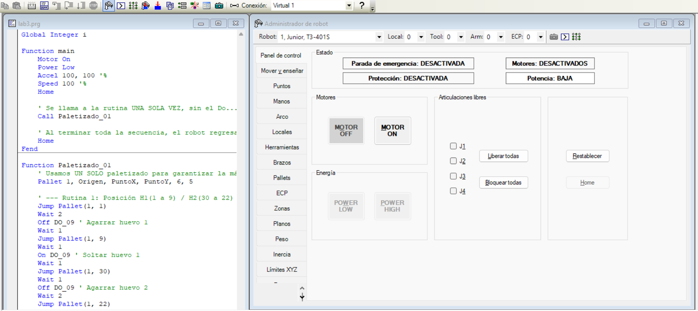
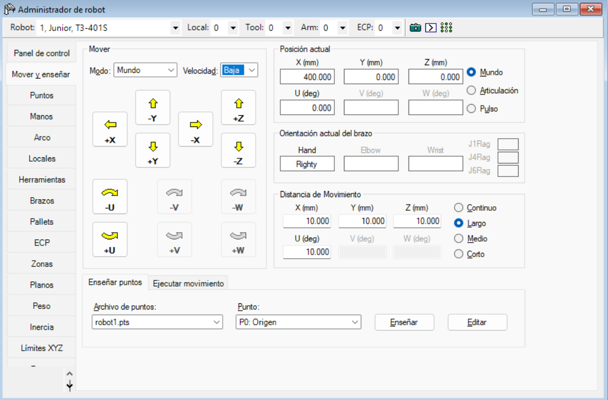
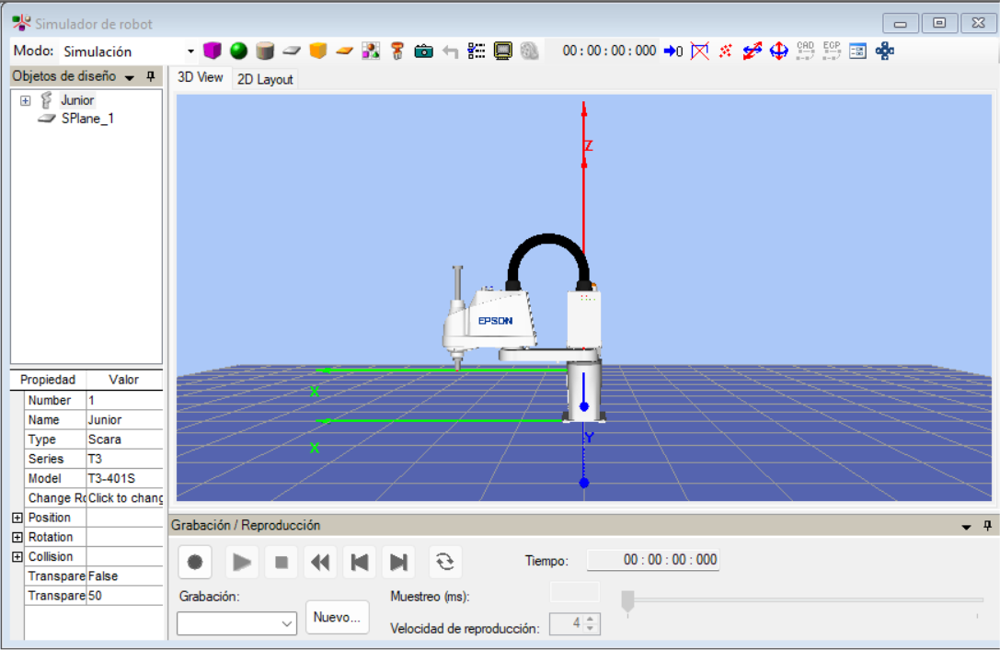

<picture>
    <source srcset="https://imgur.com/5bYAzsb.png" media="(prefers-color-scheme: dark)">
    <source srcset="https://imgur.com/Os03JoE.png" media="(prefers-color-scheme: light)">
    
</picture>

<h3>Curso de Robótica 2026-I</h3>

<h1>Informe Laboratorio #3</h1>

<h2>Profesores:  Pedro Fabián Cárdenas Herrera   Manuel Felipe Carranza Montenegro </h2>

# Integrantes
1. Juan Andrés Moreno Benavides [jumorenobe@unal.co](Jumorenobe)
2. Mateo Ramos Cujer [mramoscu@unal.edu.co](MateoKGR)

# Índice

1. [Cuadro comparativo](#cuadro-comparativo)
2. [Configuración de la posición Home](#configuración-de-la-posición-home)
3. [Procedimiento de movimientos manuales](#procedimiento-de-movimientos-manuales)
4. [Control y niveles de velocidad](#control-y-niveles-de-velocidad)
5. [Funcionalidades de EPSON RC+ 7.0](#funcionalidades-de-epson-rc-70)
6. [Análisis comparativo de herramientas de software](#análisis-comparativo-de-herramientas-de-software)
7. [Diseño técnico del gripper neumático por vacío](#diseño-técnico-del-gripper-neumático-por-vacío)
8. [Diagrama de flujo de la trayectoria](#diagrama-de-flujo-de-la-trayectoria)
9. [Plano de planta y ubicación inicial](#plano-de-planta-y-ubicación-inicial)
10. [Código desarrollado en SPEL+](#código-desarrollado-en-spel)
11. [Videos demostrativos](#videos-demostrativos)

## Cuadro comparativo de manipuladores

| Característica | **EPSON T3-401S** | **Motoman MH6** | **ABB IRB140** |
|----------------|--------------------|------------------|----------------|
| **Tipo de robot** | SCARA (4 ejes) | Articulado (6 ejes) | Articulado (6 ejes) |
| **Grados de libertad (DOF)** | 4 | 6 | 6 |
| **Carga máxima (Payload)** | 3 kg | 6 kg | 6 kg |
| **Alcance máximo** | 400 mm | 1373 mm | 810 mm |
| **Repetibilidad** | ±0.02 mm | ±0.08 mm | ±0.03 mm |
| **Velocidad máxima** | Hasta 4500 mm/s (ejes XY) | 230°/s (articulaciones) | 225°/s (articulaciones) |
| **Montaje** | De mesa (compacto) | En piso, pared o techo | En piso, pared o invertido |
| **Controlador** | EPSON RC+ 7.0 | NX100 / DX100 | IRC5 Compact |
| **Fuente de potencia** | 200–240 V CA monofásico | 200–230 V CA trifásico | 200–600 V CA trifásico |
| **Aplicaciones típicas** | Ensamble electrónico, empaque, pick and place | Soldadura, manipulación de piezas, paletizado | Ensamble, manipulación de materiales, mantenimiento de máquinas |
| **Peso del robot** | ~27 kg | ~130 kg | ~98 kg |
| **Ventajas principales** | Compacto, rápido, bajo costo y fácil de integrar | Alta carga, gran alcance, estructura robusta | Preciso, compacto, ideal para espacios reducidos |
| **Limitaciones** | Alcance corto, solo 4 ejes | Menor precisión que ABB | Mayor costo que Epson |
| **Software asociado** | EPSON RC+ 7.0 | MotoSim EG / NX100 | RobotStudio |
| **Comunicación con PC** | USB / Ethernet | Ethernet / RS-232 | Ethernet / USB |

## Configuración de la posición Home

Para el desarrollo de este laboratorio, definimos una configuración de Home personalizada en el EPSON T3-401S, reemplazando la postura que el software EPSON RC+ asigna por defecto. Con esto buscábamos que el manipulador iniciara centrado exactamente en la mitad de su área de trabajo y con el brazo extendido hacia adelante. Esto nos garantiza un alcance simétrico hacia ambos extremos de la mesa y evita que el robot comience el movimiento sesgado o limitado hacia un costado.

Para lograrlo, configuramos la primera articulación (J1) a 90°, lo que en el controlador equivale a 204800 pulsos. Con este punto base establecido, alineamos los demás ejes para conseguir una postura completamente estable y segura para la manipulación.

A continuación, detallamos los parámetros asignados a cada una de las articulaciones para nuestro Home personalizado:

* **Articulación 1 (J1 - Rotación Base):** 90° (204800 pulsos) Orienta el brazo principal hacia el centro del área de trabajo.
* **Articulación 2 (J2 - Rotación Brazo):** 0° (0 pulsos) Mantiene el segundo brazo alineado hacia el frente.
* **Articulación 3 (J3 - Eje Z Vertical):** 0 (0 pulsos) Define una altura elevada y segura para evitar colisiones con la cubeta.
* **Articulación 4 (J4/U - Rotación de Herramienta):** 0° (0 pulsos) Mantiene el eje del gripper totalmente recto y alineado.

Esta posición de Home es la referencia fundamental de todo el laboratorio. A partir de ella calibramos el origen de la cubeta de 30 posiciones ($6 \times 5$) mediante el comando `Pallet 1` y registramos la ubicación inicial de los dos huevos que interactúan en la rutina. Aunque el programa simula el recorrido independiente de dos elementos (Huevo 1 y Huevo 2), físicamente ambos comparten la misma matriz de posiciones. Por lo tanto, iniciar desde un punto inicial idéntico y reproducible era indispensable para que el conteo de las coordenadas del paletizado no acumulara desfases.

Por otra parte, la configuración de Home juega un rol crucial en la seguridad de la manipulación neumática. Debido a que la electroválvula de vacío trabaja con lógica invertida (donde `Off DO_09` activa el agarre y `On DO_09` libera el objeto), necesitábamos que el robot iniciara lo suficientemente lejos de la superficie. Al arrancar en Home y ejecutar los traslados mediante el comando `Jump Pallet(1, posición)`, el controlador se ve obligado a levantar el gripper verticalmente hasta el plano z seguro antes de descender sobre el huevo, reduciendo a cero el riesgo de romperlos o tropezar con la cubeta durante los desplazamientos horizontales.

Finalmente, esta postura garantiza la repetibilidad del código en cada ciclo de trabajo. Como se observa en nuestro programa, la instrucción `Home` se ejecuta al iniciar la función `main` para limpiar cualquier postura previa del manipulador, y se vuelve a llamar al terminar la rutina `Paletizado_01`. Esto asegura que toda la secuencia basada en el patrón de caballo de ajedrez se ejecute bajo las mismas condiciones exactas en cada simulación o prueba física.

## Procedimiento de movimientos manuales

Para mover el robot manualmente (hacer *jogging*) desde EPSON RC+ 7.0, utilizamos la ventana de **Robot Manager** o en español **Administrador de robot**, que es el centro de control donde habilitamos los motores, liberamos los frenos de las articulaciones y seleccionamos los modos de operación. El proceso es muy intuitivo, pero es obligatorio seguir un orden estricto para que el controlador reciba los comandos correctamente.

El primer paso consiste en abrir el **Administrador de robot** y presionar el botón **Reset**. Esto limpia cualquier alarma activa, falla de comunicación o estado previo que bloquee al manipulador. Con el sistema limpio, activamos los motores haciendo clic en **Motor ON**; en ese instante escucharemos el enganche físico de los frenos y el robot quedará listo para ser operado de forma manual.

Una vez habilitado, nos dirigimos a la pestaña **Mover y enseñar** o **Jog & Teach**. En esta sección configuramos el tipo de movimiento cambiando el parámetro **Modo**:

* **Modo Articular (Mode: Joint):** Al seleccionar esta opción, las teclas de control cambian a **J1, J2, J3 y J4**. Cada pulsación mueve de forma directa e independiente una sola articulación del brazo SCARA. Es el modo ideal para retirar al robot de posturas incómodas o moverlo libremente sin importar la trayectoria.
* **Modo Cartesiano (Mode: World o Mode: Tool):** Aquí el robot interpreta el espacio de forma matemática. Si seleccionamos *World*, nos moveremos respecto a la base fija del robot; si elegimos *Tool*, lo haremos respecto a la orientación de nuestra herramienta. 

Para ejecutar los desplazamientos en el modo cartesiano, el software nos presenta un panel de botones específicos. Las traslaciones lineales en línea recta se realizan presionando las flechas de los ejes **X, Y y Z** (en sus direcciones positivas `+` o negativas `-`). 

En cuanto a las rotaciones, al tratarse de un robot SCARA de 4 ejes, el EPSON T3-401S solo cuenta con la capacidad de rotar sobre su propio eje vertical a través de la coordenada **U** (los botones **V** y **W** permanecen inhabilitados ya que son exclusivos para manipuladores de 6 grados de libertad). Al presionar `+U` o `-U`, logramos que el gripper neumático gire sobre su propio centro, lo cual fue clave para orientar correctamente la succión al interactuar con la cubeta.

En esta misma ventana controlamos la velocidad del jogging seleccionando entre los niveles **Low, Medium o High**, así como la distancia de avance por cada pulsación en el modo síncrono (*Jog Dist*). Esta combinación de herramientas es la que nos permite aproximar el robot con total precisión a la superficie, registrar los puntos exactos de la cubeta de huevos y verificar que no existan riesgos de colisión antes de correr el código definitivo.

## Control y niveles de velocidad

Para controlar qué tan rápido y qué tan preciso se desplaza el robot cuando lo operamos de forma manual, la interfaz **Jog & Teach** de EPSON RC+ 7.0 nos ofrece dos paneles de configuración complementarios: el control directo de velocidad (**Speed**) y la distancia de avance (**Jog Distance**). La combinación de ambos es lo que determina la sensibilidad del robot durante el jogging.

### 1. Niveles de velocidad directa 
En la parte superior de la interfaz, contamos con un selector de dos niveles de velocidad de ejecución para los motores: **Baja (Low)** y **Alta (High)**. 
* Para las pruebas iniciales y la aproximación a la cubeta de huevos, mantuvimos el nivel en **Low**. Esto aplica un límite seguro a la potencia de los motores, evitando reacciones bruscas o colisiones por algún error de digitación.
* El nivel **High** aumenta la aceleración y la rapidez del robot, lo cual es útil para traslados libres en espacios abiertos de la mesa de trabajo.

### 2. Distancia de movimiento
Afecta de forma directa la percepción de "velocidad" y control, ya que define matemáticamente la longitud o el ángulo que el robot avanzará por cada pulsación individual en los botones de movimiento:

* **Corto (Short):** Configura desplazamientos con pasos milimétricos muy pequeños. Es la opción indispensable cuando el gripper está muy cerca de los huevos o de la superficie de la cubeta, permitiéndonos realizar un ajuste fino de los puntos de enseñanza sin riesgo de estrellar la herramienta.
* **Medio (Medium):** Ofrece un equilibrio ideal entre velocidad y precisión, sirviendo para acercamientos intermedios dentro del cuadrante de trabajo.
* **Largo (Large):** El robot ejecuta desplazamientos con pasos amplios. Se percibe como un movimiento mucho más rápido y es ideal para cubrir grandes distancias de un extremo a otro de la mesa de forma ágil.
* **Continuos (Continuou):** A diferencia de los anteriores (que son pasos discretos), este modo hace que el robot se mueva de forma ininterrumpida mientras mantengamos presionado el botón del eje, deteniéndose inmediatamente al soltarlo.

Justo encima de estas opciones, el software nos permite modificar los valores numéricos exactos en milímetros para las traslaciones (**X, Y, Z**) y en grados para la rotación de la herramienta (**U**). 

## Funcionalidades de EPSON RC+ 7.0

El software **EPSON RC+ 7.0** es el entorno de desarrollo integrado (IDE) que nos permite programar, simular y controlar nuestro robot SCARA. Su función principal es servir como puente de comunicación e intermediario entre las líneas de código que escribimos en lenguaje SPEL+ y las acciones físicas del manipulador en el espacio de trabajo.

### 1. Gestión de conexión (Físico vs. Virtual)
El software nos permite conectarnos al robot mediante distintos tipos de controladores, para este lab utilizamos dos:
* **Conexión USB (Modo Físico):** Para las pruebas reales en el laboratorio, enlazamos la computadora con el controlador integrado en la base del EPSON T3-401S a través de un cable **USB**. Por este medio, el software envía los comandos de movimiento y recibe telemetría constante sobre el estado de los motores.
* **Conexión Virtual (Modo Simulación):** Cuando trabajamos fuera del laboratorio, el software nos permite crear un "controlador virtual" que emula matemáticamente el comportamiento exacto del robot.

### 2. Entorno de simulación en 3D
Al activar el controlador virtual, habilitamos su simulador tridimensional. Este entorno nos permite recrear la estación de trabajo y modelar objetos. En nuestro caso, nos sirvió para verificar visualmente que los desplazamientos del brazo cubrieran toda la superficie de la cubeta de huevos sin sobrepasar los límites de las articulaciones, validando el código de forma segura y libre de colisiones antes de ejecutarlo en el hardware real.

### 3. Procesamiento y ejecución de movimientos
Es importante destacar que el software EPSON RC+ instalado en la computadora no manipula directamente los motores del robot; en su lugar, delega esa tarea mediante el siguiente proceso interno:

1. **Compilación del código:** Cuando ordenamos correr el programa, EPSON RC+ traduce nuestras instrucciones de alto nivel (como `Home`, `Jump Pallet` o `Off DO_09`) en comandos binarios de bajo nivel.
2. **Envío de datos:** Estas instrucciones procesadas se transmiten en paquetes de datos a través del cable USB hacia el controlador del robot.
3. **Cálculo cinemático:** Al recibir la orden (por ejemplo, moverse a la posición 9 del palette), el controlador calcula internamente la cinemática inversa. Esto significa que calcula exactamente cuánto debe girar cada articulación y a qué velocidad para que la herramienta llegue al destino en el tiempo correcto.
4. **Ejecución física:** Finalmente, el controlador transforma esos cálculos en pulsos eléctricos para los servomotores de los 4 ejes y en señales digitales para activar o desactivar la salida neumática `DO_09`.

Dado que este proceso de cálculo e interpolación de trayectorias es idéntico tanto en el controlador virtual como en el físico, toda la lógica del patrón de caballo que perfeccionamos en la simulación se comportó de manera idéntica y predecible al implementarla en el laboratorio.

