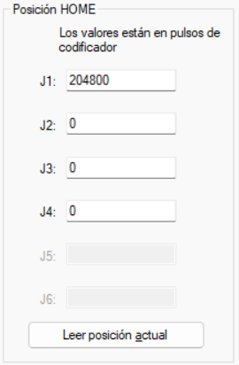

<picture>
    <source srcset="https://imgur.com/5bYAzsb.png" media="(prefers-color-scheme: dark)">
    <source srcset="https://imgur.com/Os03JoE.png" media="(prefers-color-scheme: light)">
    
</picture>

<h3>Curso de Robótica 2026-I</h3>

<h1>Informe Laboratorio #3</h1>

<h2>Profesores:  Pedro Fabián Cárdenas Herrera   Manuel Felipe Carranza Montenegro </h2>

# Integrantes
1. Juan Andrés Moreno Benavides [jumorenobe@unal.co](Jumorenobe)
2. Mateo Ramos Cujer [mramoscu@unal.edu.co](MateoKGR)

# Índice

1. [Cuadro comparativo](#cuadro-comparativo)
2. [Configuración de la posición Home](#configuración-de-la-posición-home)
3. [Procedimiento de movimientos manuales](#procedimiento-de-movimientos-manuales)
4. [Control y niveles de velocidad](#control-y-niveles-de-velocidad)
5. [Funcionalidades de EPSON RC+ 7.0](#funcionalidades-de-epson-rc-70)
6. [Análisis comparativo de herramientas de software](#análisis-comparativo-de-herramientas-de-software)
7. [Diseño técnico del gripper neumático por vacío](#diseño-técnico-del-gripper-neumático-por-vacío)
8. [Diagrama de flujo de la trayectoria](#diagrama-de-flujo-de-la-trayectoria)
9. [Plano de planta y ubicación inicial](#plano-de-planta-y-ubicación-inicial)
10. [Código desarrollado en SPEL+](#código-desarrollado-en-spel)
11. [Videos demostrativos](#videos-demostrativos)

## Cuadro comparativo de manipuladores

| Característica | **EPSON T3-401S** | **Motoman MH6** | **ABB IRB140** |
|----------------|--------------------|------------------|----------------|
| **Tipo de robot** | SCARA (4 ejes) | Articulado (6 ejes) | Articulado (6 ejes) |
| **Grados de libertad (DOF)** | 4 | 6 | 6 |
| **Carga máxima (Payload)** | 3 kg | 6 kg | 6 kg |
| **Alcance máximo** | 400 mm | 1373 mm | 810 mm |
| **Repetibilidad** | ±0.02 mm | ±0.08 mm | ±0.03 mm |
| **Velocidad máxima** | Hasta 4500 mm/s (ejes XY) | 230°/s (articulaciones) | 225°/s (articulaciones) |
| **Montaje** | De mesa (compacto) | En piso, pared o techo | En piso, pared o invertido |
| **Controlador** | EPSON RC+ 7.0 | NX100 / DX100 | IRC5 Compact |
| **Fuente de potencia** | 200–240 V CA monofásico | 200–230 V CA trifásico | 200–600 V CA trifásico |
| **Aplicaciones típicas** | Ensamble electrónico, empaque, pick and place | Soldadura, manipulación de piezas, paletizado | Ensamble, manipulación de materiales, mantenimiento de máquinas |
| **Peso del robot** | ~27 kg | ~130 kg | ~98 kg |
| **Ventajas principales** | Compacto, rápido, bajo costo y fácil de integrar | Alta carga, gran alcance, estructura robusta | Preciso, compacto, ideal para espacios reducidos |
| **Limitaciones** | Alcance corto, solo 4 ejes | Menor precisión que ABB | Mayor costo que Epson |
| **Software asociado** | EPSON RC+ 7.0 | MotoSim EG / NX100 | RobotStudio |
| **Comunicación con PC** | USB / Ethernet | Ethernet / RS-232 | Ethernet / USB |

## Configuración de la posición Home

Para el desarrollo de este laboratorio, definimos una configuración de Home personalizada en el EPSON T3-401S, reemplazando la postura que el software EPSON RC+ asigna por defecto. Con esto buscábamos que el manipulador iniciara centrado exactamente en la mitad de su área de trabajo y con el brazo extendido hacia adelante. Esto nos garantiza un alcance simétrico hacia ambos extremos de la mesa y evita que el robot comience el movimiento sesgado o limitado hacia un costado.

Para lograrlo, configuramos la primera articulación (J1) a 90°, lo que en el controlador equivale a 204800 pulsos. Con este punto base establecido, alineamos los demás ejes para conseguir una postura completamente estable y segura para la manipulación.

A continuación, detallamos los parámetros asignados a cada una de las articulaciones para nuestro Home personalizado:

* **Articulación 1 (J1 - Rotación Base):** 90° (204800 pulsos) Orienta el brazo principal hacia el centro del área de trabajo.
* **Articulación 2 (J2 - Rotación Brazo):** 0° (0 pulsos) Mantiene el segundo brazo alineado hacia el frente.
* **Articulación 3 (J3 - Eje Z Vertical):** 0 (0 pulsos) Define una altura elevada y segura para evitar colisiones con la cubeta.
* **Articulación 4 (J4/U - Rotación de Herramienta):** 0° (0 pulsos) Mantiene el eje del gripper totalmente recto y alineado.

Esta posición de Home es la referencia fundamental de todo el laboratorio. A partir de ella calibramos el origen de la cubeta de 30 posiciones ($6 \times 5$) mediante el comando `Pallet 1` y registramos la ubicación inicial de los dos huevos que interactúan en la rutina. Aunque el programa simula el recorrido independiente de dos elementos (Huevo 1 y Huevo 2), físicamente ambos comparten la misma matriz de posiciones. Por lo tanto, iniciar desde un punto inicial idéntico y reproducible era indispensable para que el conteo de las coordenadas del paletizado no acumulara desfases.

Por otra parte, la configuración de Home juega un rol crucial en la seguridad de la manipulación neumática. Debido a que la electroválvula de vacío trabaja con lógica invertida (donde `Off DO_09` activa el agarre y `On DO_09` libera el objeto), necesitábamos que el robot iniciara lo suficientemente lejos de la superficie. Al arrancar en Home y ejecutar los traslados mediante el comando `Jump Pallet(1, posición)`, el controlador se ve obligado a levantar el gripper verticalmente hasta el plano z seguro antes de descender sobre el huevo, reduciendo a cero el riesgo de romperlos o tropezar con la cubeta durante los desplazamientos horizontales.

Finalmente, esta postura garantiza la repetibilidad del código en cada ciclo de trabajo. Como se observa en nuestro programa, la instrucción `Home` se ejecuta al iniciar la función `main` para limpiar cualquier postura previa del manipulador, y se vuelve a llamar al terminar la rutina `Paletizado_01`. Esto asegura que toda la secuencia basada en el patrón de caballo de ajedrez se ejecute bajo las mismas condiciones exactas en cada simulación o prueba física.

